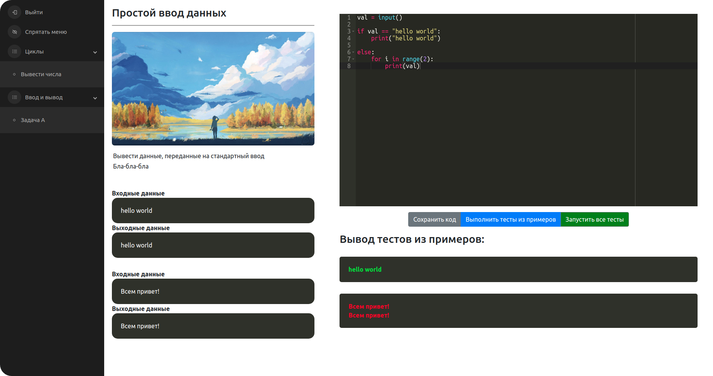

# Система онлайн программирования



## Как это работает?
Проект представляет собой сайт, на котором можно выполнять задания по программированию и сразу писать
python код в окне браузера. Данный код отправляется на сервер и проходит автоматические тесты. Тесты
из примеров возвращают полученный результат пользователю. Для прохождения задания должны 
быть выполнены и "скрытые" тесты, результаты которых не показываются пользователю. Весь введённый
на сайте код сохраняется на сервере. Редактировать/создавать темы заданий, сами задания (вместе с их
вводимыми/выводимыми данными примеров и "скрытых" тестов), а также добавлять/удалять пользователей
можно через панель администрирования. API написан на FastAPI, панель администрирования на 
Flask-Admin и доступна на ресурсе /admin, фронтенд сделан на React.


## Как запустить систему?
1. Придумать пароль и логин для базы данных MongoDB. Открыть **docker-compose.yml** и в сервисе **mongo**
указать эти данные:
```yaml
mongo:
    ...
    environment:
        MONGO_INITDB_ROOT_USERNAME: <Your username>
        MONGO_INITDB_ROOT_PASSWORD: <Your password>
```

2. Аналогичные данные подставить в сервис **admin**:
```yaml
admin:
    ...
    environment:
        MONGODB_HOST: mongo # совпадает с именем сервиса mongo 
        MONGODB_USERNAME: <Your username>
        MONGODB_PASSWORD: <Your password>
```

3. Остаётся указать эти данные для API сервера. Это можно сделать, отредактировав файл **backend/core/.env**,
либо же добавив параметр **MONGODB_DATABASE_URI** сразу в переменные среды сервиса backend:
```yaml
backend:
    ...
    environment:
        DOCKER_HOST: tcp://docker-root:2375
        MONGODB_DATABASE_URI: mongodb://<username>:<password>@mongo:27017/?authSource=admin
```

4. Для доступа к dashboard-у traefik-а (который доступен на 8080-ом порту), нужно сгенерировать
   строку пароля и логина через утилиту **htpasswd** и подставить её в файле **traefik/dashboard.yml**:
```yaml
basicAuth:
    users:
      - <Your username>:<Your htpasswd generated password>
```

5. Чтобы включить поддержку TLS от Let's Encrypt, нужно выставить параметры секции tls в файле traefik.yml,
как это описано в самой официальной документации taefik. Сейчас там указан url для получения тестового
  tls сертификата. Если нужно разнести сервисы по поддоменам, то в параметры url нужных router-ов 
  можно добавить правило Host, чтобы получилось приблизительно так:
   ```yaml
   rule: <Other rules> && Host(`my.subdomain.example.com`)
   ```
6. В файле **frontend/.env** необходимо указать, какая основа используется для доступа к api. Она будет
автоматически подставляться при совершении запросов к API. По-умолчанию выставлен **https://localhost**
<br><br/>
7. Внутри главной директории репозитория выполнить команду и тем самым запустить систему:
```bash
docker-compose up -d
```

 ## Зависимости
1. Только стандартный docker (в данной версии приложения подразумевается, что используется не
 rootless docker, это важно для D-in-D).
 2. Docker-compose для запуска всех компонентов системы

## Тесты
* PyLinter проверяет качество python-кода
* PyTest запускает тесты для backend API части 

## TODO
* Добавить kubernetes конфигурацию
* Добавить реализацию тестов класса MongoDB на отдельно поднимаемой базе данных
* Добавить мобильную flutter версию проекта
* Добавить генерирование документации проекта на пайплайне
* Добавить микросервис логирования
* Вынести "Runner-а тестов" в виде отдельного микросервиса на golang + gRPC
* Добавить поддержку заданий с выбором и вводом ответа
* Добавить выгрузку результатов работы для администратора  
